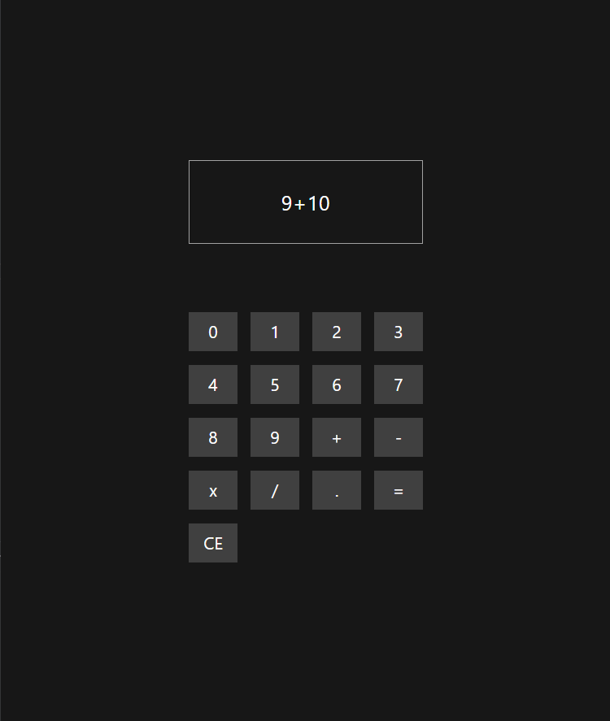

# 🖩 Calculator App

## 📦 Technologies

Built with:

- `React`
- `Vite`
- `Typescript`
- `Tailwind CSS`

## ⚙️ Getting Started

1. Clone the repository
2. Install dependencies: npm install
3. Start the development server: npm run dev
4. Open http://localhost:5173 in your browser
